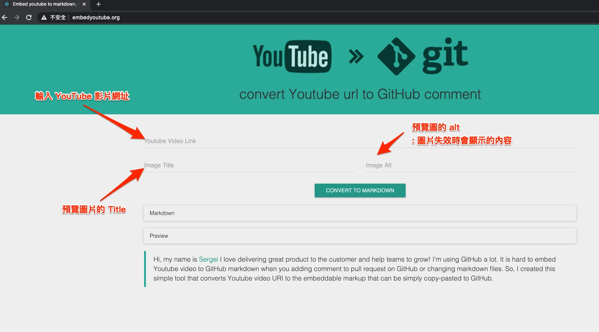
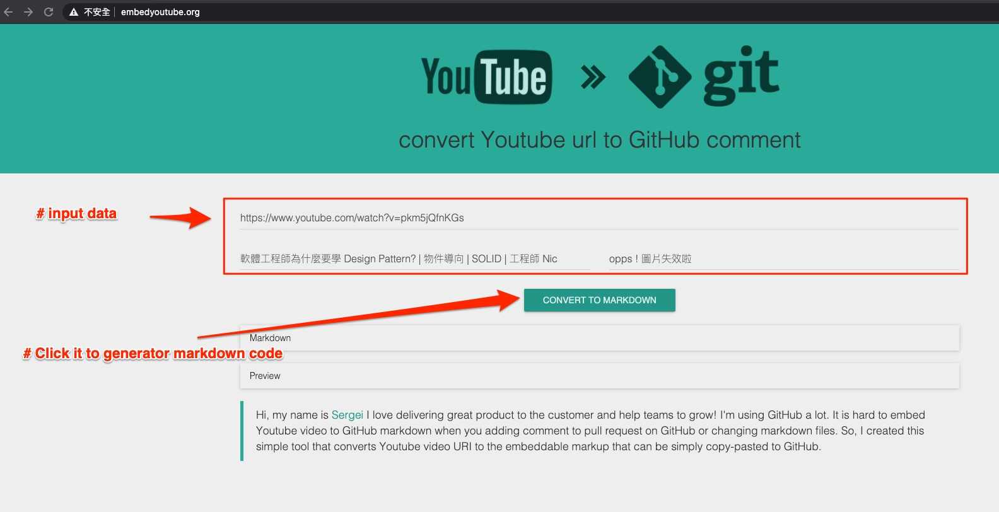
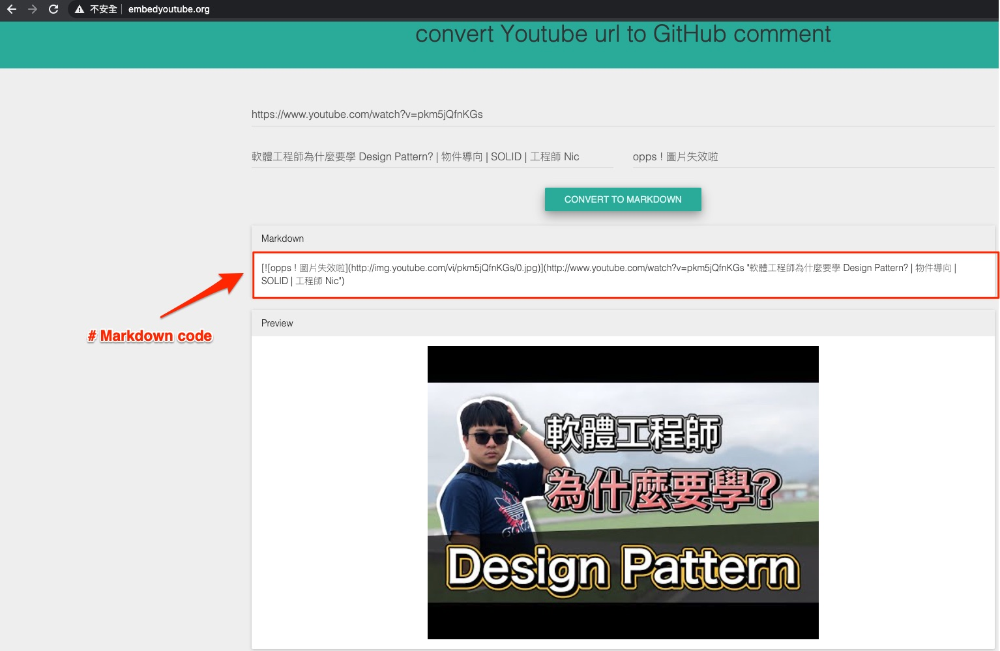

# Embed youtube to markdown

嵌入 youtube 影片到 markdown 的線上工具。

---

## 大綱

- [Embed youtube to markdown](#embed-youtube-to-markdown)
  - [大綱](#大綱)
  - [概要](#概要)
  - [說明](#說明)
  - [參考](#參考)

---

## 概要

可以將 Youtube 的影片轉換成 markdown 語法，

語法內容涵蓋

- youtube 影片 縮圖

  - 縮圖的 Title

  - 縮圖的 alt

    > 圖片失效時會顯示的文字。

- youtube 影片 連結

---

## 說明

[工具 網址](http://embedyoutube.org/)

- 網站的使用概念圖 :

  

- Sample - Input Data :

  

- Sample - Generator Markdown Code :

  

- Sample Code :

```markdown
    [](http://www.youtube.com/watch?v=pkm5jQfnKGs "軟體工程師為什麼要學 Design Pattern? | 物件導向 | SOLID | 工程師 Nic")
```

- Sample Result :

  [](http://www.youtube.com/watch?v=pkm5jQfnKGs "軟體工程師為什麼要學 Design Pattern? | 物件導向 | SOLID | 工程師 Nic")

---

## 參考

- [Embed youtube to markdown, GitLab, GitHub](http://embedyoutube.org/)

---

[=> Top](#embed-youtube-to-markdown)

[=> Go Back](../README.md)
