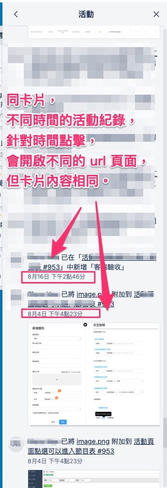
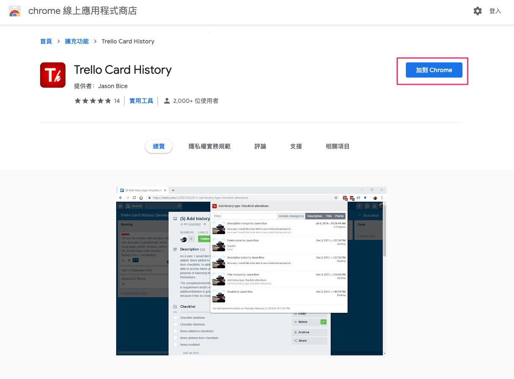
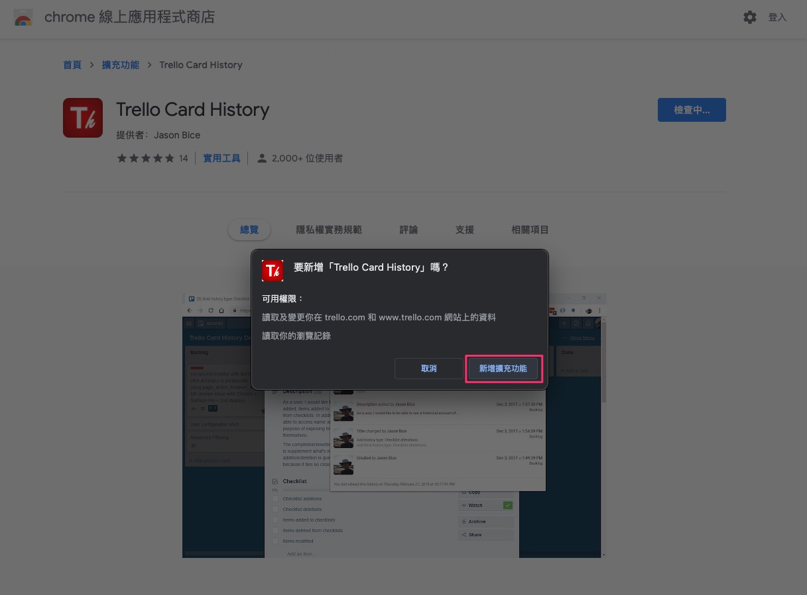
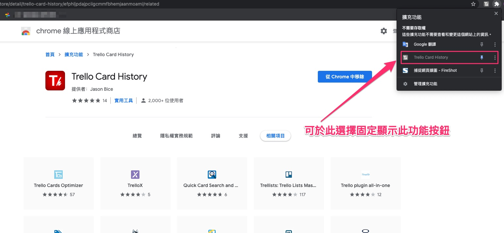
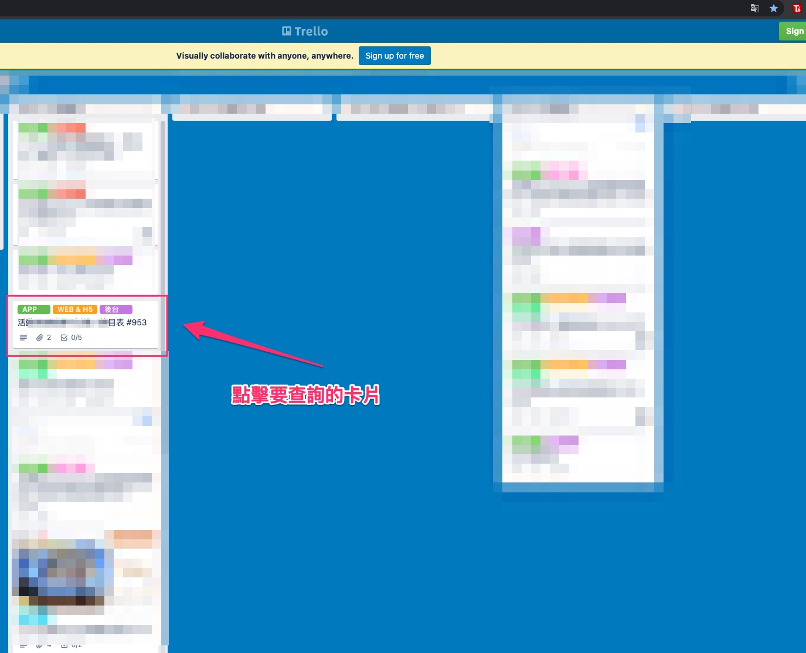
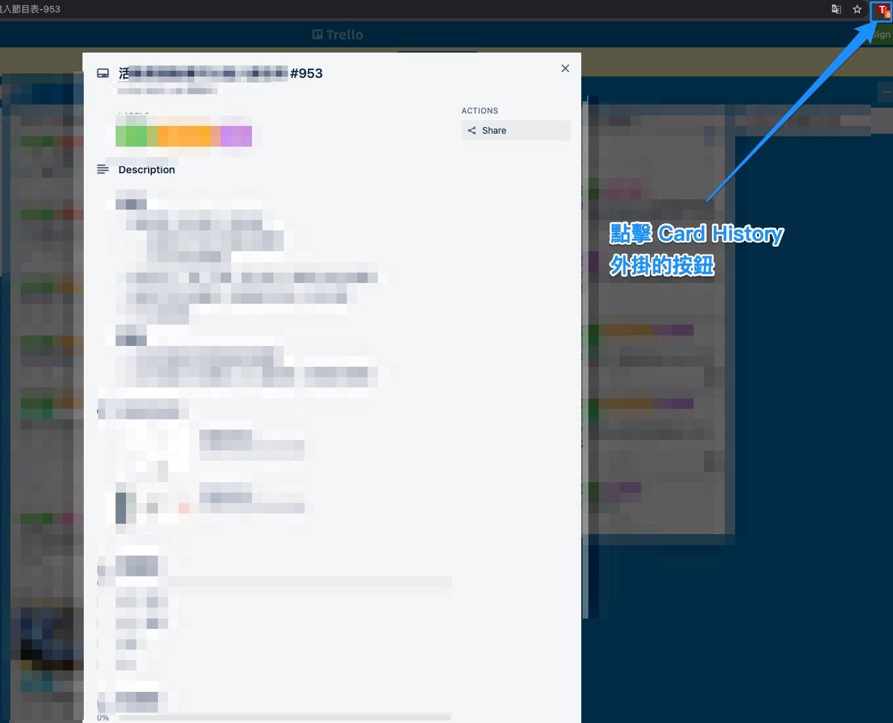
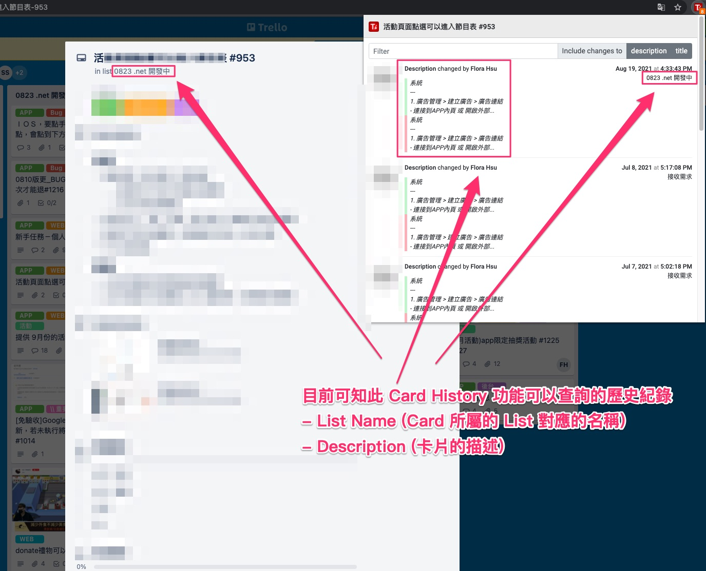

# Card History

在開發過程中，有時會遇到一些記憶上的不確定性，

若在講需求時，用卡片的描述來當需求的起始討論，

則可以用 Card History 來當作輔助的外掛工具使用。

- 紀錄時間 : 2021-08-19

---

## 緣由

由於 Trello 官方沒有提供 Card 的歷史紀錄查詢，

若是用活動來查詢的話，會變成最後修改項目。

所以可以用此套工具來輔助。

- 活動紀錄參考

  

  點擊過去的 url 雖然不同，

  但卡片內容會相同，

  跟預想想的歷史紀錄不同。

---

## Chrome 外掛

有找到 Chome 的外掛套件 : [Trello Card History - Chrome 線上應用程式商店] ，

這邊有可以針對卡片做歷史紀錄的查詢。

可能是我們想要的工具。

---

## 安裝以及使用方式

- 01 : Chorme 外掛安裝

  

- 02 : 新增擴充功能

  

- 03 : 可選擇固定顯示此功能按鈕

  

- 04 : 點擊想查詢的卡片

  

- 05 : 點擊 Card History 外掛按鈕

  

- 06 : Card History 內容顯示

  

  > 還有一些小功能可以展開，例如 顯示 diff 。
  >
  > 這個就交由使用者來玩看看了。

---

## 可以做到什麼

目前可知此 Card History 功能可以查詢的歷史紀錄

- List Name (Card 所屬的 List 對應的名稱)

- Description (卡片的描述)

若需求的主要的內容是以`描述`來當依據，

則此 Card History Chrome 外掛應該協助一些資訊的查詢。

---

## 目前不支援的歷史紀錄

紀錄時間當下 (2021-08-19)，無法有歷史紀錄的有 :

> 有想到的，可能不限於此。

- 待辦清單 (Checklist)

- 評論

- 活動

- ...

---

## 參考

- [Trello Card History - Chrome 線上應用程式商店]

---

<!-- 連結設定 -->

[Trello Card History - Chrome 線上應用程式商店]:
https://chrome.google.com/webstore/detail/trello-card-history/efphljpdajpciigcmmfbhemjaanmoami/related

---

[=> Top](#card-history)

[=> Go Back](../README.md)
